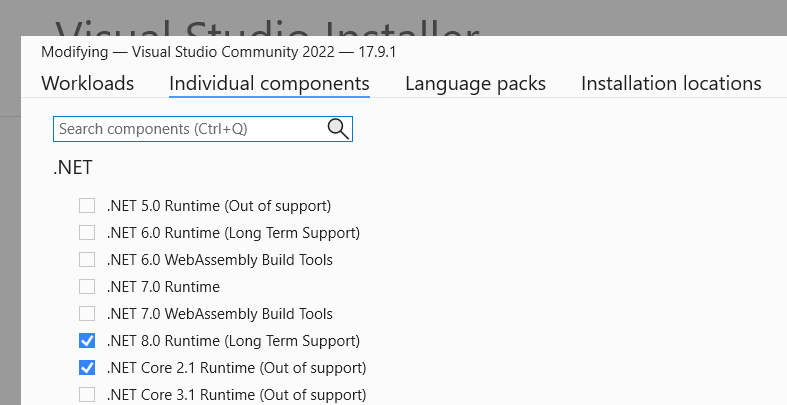
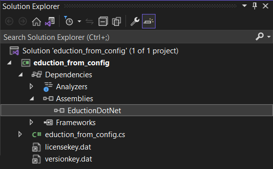
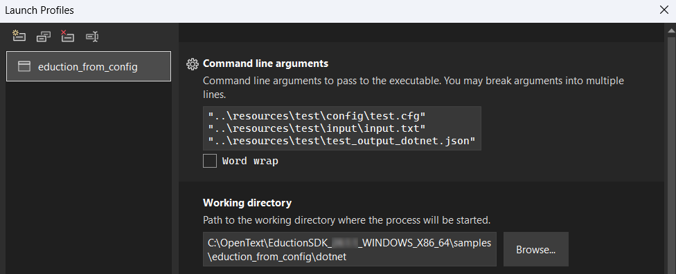
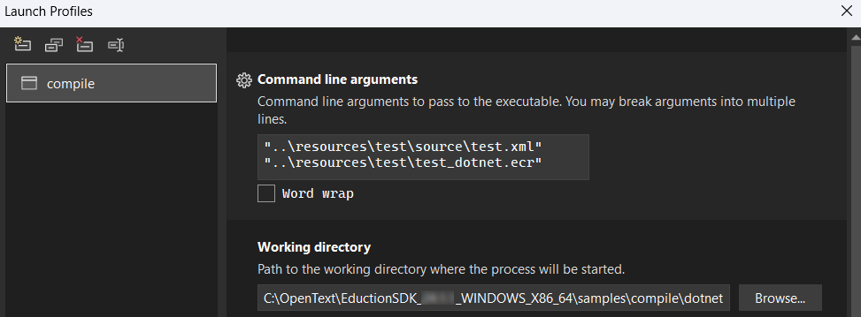

# Eduction SDK .NET API

The Eduction SDK is designed to be embedded into other services.

To facilitate embedding, the Eduction SDK has APIs for C, Java and .NET.  In addition, the Eduction SDK runs natively on the following platforms: Windows (x86_64), Linux (x86_64 and ARM_64), MacOS (x86_64 and Apple M*). 

In this lesson, you will:
- use the Eduction SDK .NET API to perform extraction using a configuration file
- use the Eduction SDK .NET API to compile a grammar XML into an ECR

The [Eduction User and Programming Guide](https://www.microfocus.com/documentation/idol/IDOL_24_2/EductionSDK_24.2_Documentation/Guides/html/Content/EductionSDK/APIReference/DotNet_APIConcepts.htm) has sections on this topic which will be referenced in this lesson.

> NOTE: This lesson only covers the Eduction SDK APIs and does not cover Eduction Server. See [here](./README.md#use-idol-eduction-server) for a lesson on Eduction Server.

> NOTE: This guide assumes you have already completed the introductory Eduction [tutorial](../eduction/introduction.md#eduction-sdk-introduction).

---

- [Setup](#setup)
  - [License and Version key dat files](#license-and-version-key-dat-files)
  - [Resources](#resources)
  - [Environment and Compilers](#environment-and-compilers)
- [API Documentation](#api-documentation)
- [Example programs](#example-programs)
  - [`eduction_from_config`](#eduction_from_config)
    - [Sample code](#sample-code)
      - [Shared Library location](#shared-library-location)
      - [License and version key locations](#license-and-version-key-locations)
    - [Compile](#compile)
    - [Run](#run)
  - [`compile`](#compile-1)
    - [Sample code](#sample-code-1)
    - [Compile and run](#compile-and-run)
- [Conclusion](#conclusion)
- [See also](#see-also)

---

## Setup

Before you continue with this lesson, refer to the [documentation links](#see-also) below.

Refer to `README.md` in the `C:\OpenText\EductionSDK_24.2.0_WINDOWS_X86_64\samples` folder for API language and platform specific requirements and instructions to build the sample programs.

> NOTE: This lesson assumes you have already completed the [Eduction SDK introduction](../eduction/introduction.md#eduction-sdk-introduction) lesson covering essential setup steps (*e.g.* required downloads and installation steps) and basic Eduction concepts.

### License and Version key dat files

Deploy the `licensekey.dat` and `versionkey.dat` files to the EductionSDK home directory (e.g. `C:\OpenText\EductionSDK_24.2.0_WINDOWS_X86_64`).

> NOTE: An improved method to incorporate `versionkey.dat` is implemented as part of the provided resources, where you must ignore the release notes recommendation to pre-concatenate the `licensekey.dat` and `versionkey.dat`, delimited by a `;`. 

### Resources

You must download the following resources before you continue:
- source code and build tools
  - [eduction_from_config/dotnet](../../resouces/eduction/sdk/samples/eduction_from_config/dotnet)
  - [compile/dotnet](../../resouces/eduction/sdk/samples/compile/dotnet)

> NOTE: Deploy these resources to the `%EDK_HOME%\samples` folder, adding to and/or replacing what is provided with EductionSDK.

### Environment and Compilers

- Refer to the `System Requirements` section of the [IDOL Getting Started Guide](https://www.microfocus.com/documentation/idol/IDOL_24_2/IDOLServer_24.2_Documentation/Guides/html/gettingstarted/Content/Install_Run_IDOL/Install/System_Requirements.htm) for general software dependencies.
- Refer to [Eduction User & Programming Guide - Deploy Eduction SDK - .NET API Component](https://www.microfocus.com/documentation/idol/IDOL_24_2/EductionSDK_24.2_Documentation/Guides/html/Content/EductionSDK/DeployEductionSDK/DotNet_API.htm) for API and platform specific software dependencies.
- The `README.md` in `C:\OpenText\EductionSDK_24.2.0_WINDOWS_X86_64\samples` notes more API language and platform specific requirements (*e.g.* compiler information, build tools) and build tips.

> HINT: For example, if you use Visual Studio Community 2022 in Windows 11, installed from https://visualstudio.microsoft.com/downloads/, run the Visual Studio Installer and ensure you have the ".NET Core 2.1 Runtime" component installed:
> 
> 

## API Documentation

API specific documentation is located in sub-folders of `C:\OpenText\EductionSDK_24.2.0_WINDOWS_X86_64\` as noted below:
- .NET - `dotnet_api\help\index.html`

## Example programs

Example programs (with resources) ship with the `EductionSDK_<VERSION>_<PLATFORM>.zip` and `EductionGrammars_<VERSION>_COMMON.zip`.  The sample programs cover topics:
- performing different types of extraction / redaction.
- compiling an XML grammar into an ECR file

### `eduction_from_config`

The `eduction_from_config` sample program accepts a configuration file as you've been using in the other Eduction lessons, an UTF-8 text file, a path to the output JSON file and some optional arguments to override the configuration.

#### Sample code

The C# sample `eduction_from_config` application code lives in: `C:\OpenText\EductionSDK_24.2.1_WINDOWS_X86_64\samples\eduction_from_config\dotnet`.

Overwrite the two `.cs` and `.csproj` files in that folder with the updated examples shipped with these tutorials in the resources folder [eduction_from_config/dotnet](../../resouces/eduction/sdk/samples/eduction_from_config/dotnet).

These files include an improved method for using the `versionkey.dat` file.

Double-click on the modified `eduction_from_config.csproj` to open the sample code in Visual Studio 2022.

##### Shared Library location

To check you have a correct reference to the Eduction share library, in the "Solution Explorer" pane, under "Dependencies", open "Assemblies" and select "EductionDotNet".



You should see that the "Path" property correctly references the location of your `EductionDotNet.dll`:


##### License and version key locations

To check you have a correct reference to your license and version keys, in the Solution Explorer pane, select "licensekey.dat" and "versionkey.dat".

You should see the expected locations ("Full Path") to, *e.g.*  your license key `C:\OpenText\EductionSDK_24.2.1_WINDOWS_X86_64\licensekey.dat`:


Ensure that you copy your own license and version key `.dat` files to that location, renaming the file if necessary. 

#### Compile

In the top menu bar, click the green play icon to build the project in debug mode:


After successfully building, the application will automatically run.

You will see an error message to explain that the sample application expects to received some input options to run:


#### Run

Let's provide the required input options and run in debug mode again.

- Click the debug properties menu option to open the "Launch Profiles" window:
    

    > NOTE: This sample application comes with a resources folder containing test files, which we will use, located *e.g.* at `C:\OpenText\EductionSDK_24.2.1_WINDOWS_X86_64\samples\eduction_from_config\resources\test`.

- In the "Command line arguments" input box, enter the following three paths (separated onto new lines):
    ```
    "..\resources\test\config\test.cfg"
    "..\resources\test\input\input.txt"
    "..\resources\test\test_output_dotnet.json"
    ```

- In the "Working directory" input box, enter the following path:
    ```
    C:\OpenText\EductionSDK_24.2.1_WINDOWS_X86_64\samples\eduction_from_config\dotnet
    ```

    

- Close the "Launch Profiles" window.
  
- In the top menu bar, again click the green play icon to re-build the project in debug mode.
  
    

This time the program should run and produce an output file `C:\OpenText\EductionSDK_24.2.1_WINDOWS_X86_64\samples\eduction_from_config\resources\test\test_output_dotnet.json` containing two matches, as follows:

```json
{
  "matches": [
    {
      "matched_text": "foo bar",
      "entity_name": "test/two_words",
      "offset": 12,
      "offset_length": 12,
      "matched_text_length": 7,
      "matched_text_size": 7,
      "normalized_text": "foo bar",
      "normalized_text_length": 7,
      "normalized_text_size": 7,
      "score": 1.00,
      "components": [
        {
          "name": "FIRST",
          "normalized_text": "foo",
          "normalized_text_length": 3,
          "normalized_text_size": 3,
          "normalized_text_offset": 0,
          "normalized_text_offset_length": 0
        },
        {
          "name": "SECOND",
          "normalized_text": "bar",
          "normalized_text_length": 3,
          "normalized_text_size": 3,
          "normalized_text_offset": 4,
          "normalized_text_offset_length": 4
        }
      ]
    },
    {
      "matched_text": "baz bah",
      "entity_name": "test/two_words",
      "offset": 20,
      "offset_length": 20,
      "matched_text_length": 7,
      "matched_text_size": 7,
      "normalized_text": "baz bah",
      "normalized_text_length": 7,
      "normalized_text_size": 7,
      "score": 1.00,
      "components": [
        {
          "name": "FIRST",
          "normalized_text": "baz",
          "normalized_text_length": 3,
          "normalized_text_size": 3,
          "normalized_text_offset": 0,
          "normalized_text_offset_length": 0
        },
        {
          "name": "SECOND",
          "normalized_text": "bah",
          "normalized_text_length": 3,
          "normalized_text_size": 3,
          "normalized_text_offset": 4,
          "normalized_text_offset_length": 4
        }
      ]
    }
  ]
}
```

For extra credit, try `eduction_from_config` on other Eduction configurations, insuring that configuration file paths are correct.

Review the `eduction_from_config` C# source code to gain more insights into how to incorporate the Eduction SDK .NET API into your application.

### `compile`

In some use cases for Eduction, custom grammars either for net-new entities and/or extending the entities in the licensed grammar packs. 

> NOTE: While the Eduction SDK engine does support XML based resource files, pre-compiling them into ECRs is recommended.

The `compile` sample program accepts a grammar XML and output ECR.

#### Sample code

The C# sample `compile` application code lives in: `C:\OpenText\EductionSDK_24.2.1_WINDOWS_X86_64\samples\compile\dotnet`.

Overwrite the two `.cs` and `.csproj` files in that folder with the updated example shipped with these tutorials in the resources folder [compile/dotnet](../../resouces/eduction/sdk/samples/compile/dotnet).

As with the previous `eduction_from_config` example, these files include an improved method for using the `versionkey.dat` file.

Double-click on the modified `compile.csproj` to open the sample code, *e.g.* in Visual Studio 2022.

As before, verify the shared library and licensekey/versionkey references are correct, *e.g.* in the "Solution Explorer" pane select "versionkey.dat".


#### Compile and run

- In the top menu bar, click next to the green play icon to open the dropdown options menu:

    

- Click the debug properties menu option to open the "Launch Profiles" window:
  
    > NOTE: This sample application comes with a resources folder containing test files, which we will use, located *e.g.* at `C:\OpenText\EductionSDK_24.2.1_WINDOWS_X86_64\samples\compile\resources\test`.

- In the "Command line arguments" input box, enter the following three paths (separated onto new lines):
    ```
    "..\resources\test\source\test.xml"
    "..\resources\test\test_dotnet.ecr"
    ```

- In the "Working directory" input box, enter the following path:
    ```
    C:\OpenText\EductionSDK_24.2.1_WINDOWS_X86_64\samples\compile\dotnet
    ```

    

- Close the "Launch Profiles" window.
  
- In the top menu bar, click the green play icon to build and run the project in debug mode.

The program should run and produce a compiled grammar file `C:\OpenText\EductionSDK_24.2.1_WINDOWS_X86_64\samples\compile\resources\test\test_dotnet.ecr`.

For extra credit, try `compile` on other Eduction grammar XML.

Review the `compile` C# source code to gain more insights into how to incorporate the Eduction SDK .NET API into your application.

## Conclusion

You now understand the basics of the Eduction SDK .NET API.

As extra credit, build and run the other sample programs in `EductionSDK_<VERSION>_<PLATFORM>\samples` and `EductionGrammars_<VERSION>_COMMON\pii\edk_samples`.  Refer to the changes in these resources and leverage the build tools & tips.

If you haven't already done so, try more tutorials that explore some of the other features available in IDOL Eduction, linked from the [main page](../README.md#capability-showcase-examples).

## See also

- [IDOL Eduction SDK User and Programming Guide](https://www.microfocus.com/documentation/idol/IDOL_24_2/EductionSDK_24.2_Documentation/Guides/html/)
- [IDOL Eduction Server User and Programming Guide](https://www.microfocus.com/documentation/idol/IDOL_24_2/EductionServer_24.2_Documentation/Help/Content/_ACI_Welcome.htm)
- [PCI Technical Note](https://www.microfocus.com/documentation/idol/IDOL_24_2/EductionGrammars_24.2_Documentation/PCI/)
- [PII Technical Note](https://www.microfocus.com/documentation/idol/IDOL_24_2/EductionGrammars_24.2_Documentation/PII/)
- [PHI Technical Note](https://www.microfocus.com/documentation/idol/IDOL_24_2/EductionGrammars_24.2_Documentation/PHI/)
- [Government Eduction Package Technical Note](https://www.microfocus.com/documentation/idol/IDOL_24_2/EductionGrammars_24.2_Documentation/GOV/)
- [IDOL and KeyView OEM Release Notes](https://www.microfocus.com/documentation/idol/IDOL_24_2/IDOLReleaseNotes_24.2_Documentation/idol/Content/SDKs/Eduction.htm)
